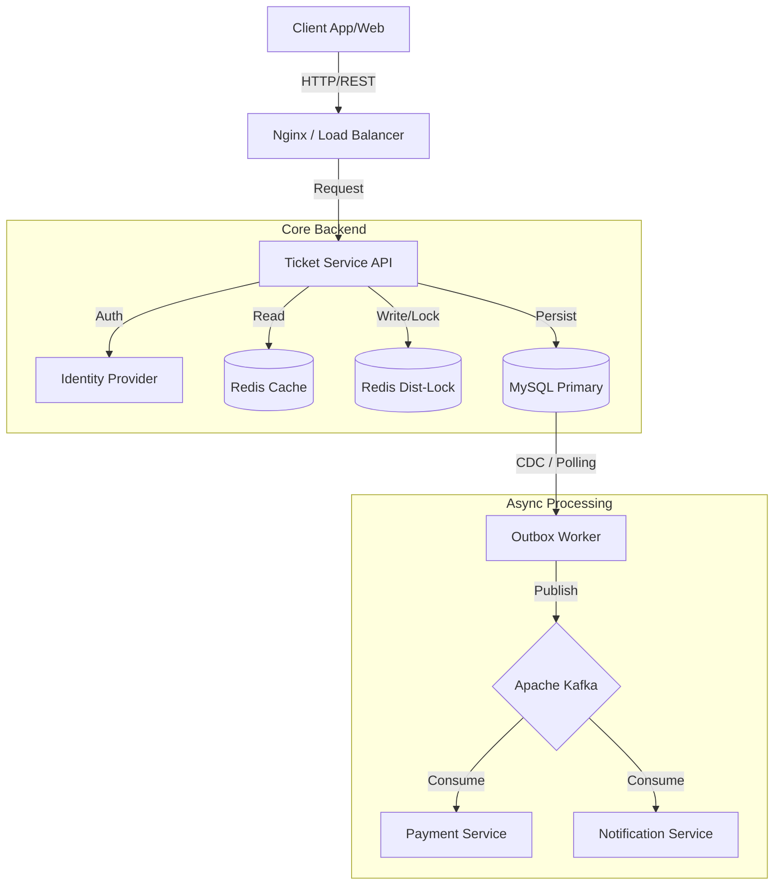
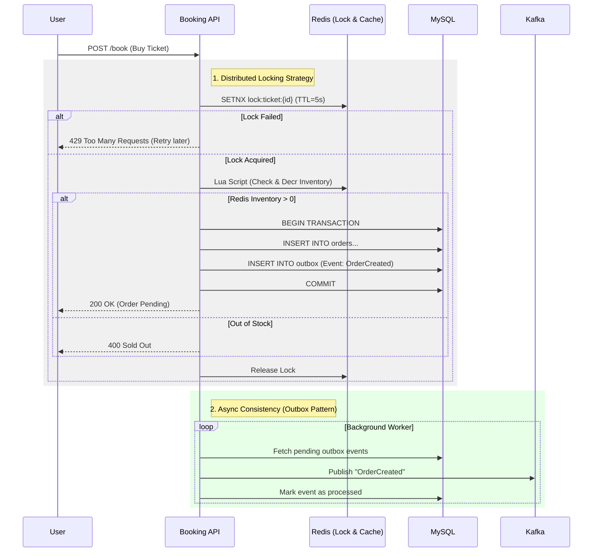

# 🎫 GoTicket - High Concurrency Event Ticketing System


**GoTicket** is a backend-focused simulation of an event ticketing platform designed to handle **high concurrency traffic** and solve complex distributed system challenges.

The project demonstrates advanced backend techniques including **Distributed Locking**, **Data Consistency Patterns**, and **High-Performance Caching**, aiming to solve the classic "Overselling" problem in e-commerce systems.

---

## 🏗 System Architecture

### High-Level Design
The system follows **Clean Architecture** principles to separate business logic from infrastructure. It is designed as a modular monolith (ready to split into microservices).



The "Booking War" Flow (Concurrency Handling)
How we handle thousands of users trying to buy the last ticket simultaneously without overselling:




## 🚀 Key Engineering Challenges Solved
1. Race Conditions & Overselling
   * Problem: 1,000 users request to buy the last ticket at the exact same millisecond.
   * Solution: Implemented Redis Distributed Lock (Redlock algorithm) combined with Lua Scripts to ensure atomicity.
   * Benchmark: Compared with Pessimistic Locking (SELECT FOR UPDATE) and Optimistic Locking (version column).

2. Cache Stampede (Thundering Herd)
   * Problem: When a popular event cache expires, thousands of requests hit the database simultaneously, causing a crash.
   * Solution: Applied Singleflight pattern (using golang.org/x/sync/singleflight) to ensure only one request hits the DB to update the cache, while others wait for the result.

3. Data Consistency (Transactional Outbox)
   * Problem: The order is created in the database, but the message to the Payment Service (via Kafka) fails due to network issues (Dual-Write Problem).
   * Solution: Implemented the Transactional Outbox Pattern. Database updates and event publishing are atomic within the same transaction.

4. Idempotency
   * Problem: Retrying failed payments or duplicate Kafka messages causes double charging.
   * Solution: Implemented Idempotency Keys at the API level and deduplication logic in consumers.

## 🛠 Tech Stack
* Language: Golang 1.22+
* Framework: Gin Gonic (HTTP), Uber Zap (Logging), Viper (Config).
* Database: MySQL 8.0 (InnoDB engine).
* Caching & Locking: Redis 7.
* Message Broker: Apache Kafka.
* Infrastructure: Docker, Docker Compose.

## 📂 Project Structure
Standard Go Layout for Scalability:

```
.
## 📂 Project Structure

Standard Go Layout with Clean Architecture:

```text
.
├── cmd/
│   └── api/                # Main entry point (main.go)
├── config/                 # Environment configurations
├── internal/
│   ├── entity/             # Domain entities (User, Ticket)
│   ├── usecase/            # Business logic (Service Layer)
│   ├── repository/         # Data Access Layer (MySQL/Redis implementation)
│   └── transport/          # Layer to handle external communication
│       ├── http/           # REST API (Gin Gonic)
│       │   ├── handler/    # Request handlers
│       │   ├── middleware/ # Auth, CORS, RateLimit middleware
│       │   └── router.go   # Route definitions
│       └── grpc/           # gRPC handlers (Future expansion)
├── pkg/                    # Public libraries (Logger, Response helpers)
├── migrations/             # SQL Migration files
├── docker-compose.yml      # Local infrastructure
├── Makefile                # Command shortcuts
└── go.mod                  # Go module definition
```